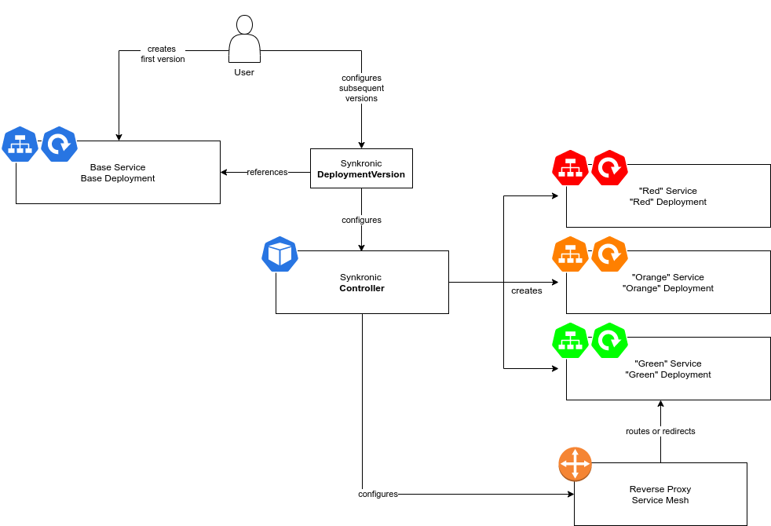

## Overview 

Rainbow deployment addresses congestion that occurs in development processes, where teams must sync and merge codebases, stabilize branches, coordinate releases all while managing workstreams, breakages and other exceptional cases.  In agile processes an unstable feature branch will often merge and deploy to environment, delaying or forcing a repeat of the release process.  

Rainbow deployment allows for an unlimited number of versions of an application to be available, and so tested and ensured to be stable before merging into any other branch.  This enables change reviewers to view development work without waiting for a coordinated release, but instead as soon as the developer is ready to push.  The flexibility of these feature branch reviews extend into higher environments, where multiple versions of a production service may run and enable blue/green style testing before activating a new version, and with versions remaining for an extended time greater options in rolling back.  Further, rainbow deployments allow for simultaneous testing of multiple versions by QA, or partial releases to subsets of service consumers.  A QA team may be targeted to test one version while another team can test a second, both receiving frequent updates.  

## Resources

[Developer's Guide](DEVGUIDE.md)

## Design

### Multiple Version Spin-up
A developer will first deply a service by making normal Deployment & Service objects.

A Synkronic Operator will run in the environment, configured by a CRD object which specifies parameters for new versions of the service.  As new versions are configured using operator CRDs, the base objects will be cloned and created using these new parameters.  Removal or modification of these CRDs will cause removal of the new versions.  

This CRD is a *DeploymentVersion* object.  It contains references to the base resources it will cause to clone, and the parameters described above.  

Another CRD *Router* may configure how the operator will modify Ingress or other services in response to creation of a new version.  



### Routing to Versions
NGinx or Traefik are capable of mapping patterns of subdomain names (version-1.mydomain.com) or URL paths (mydomain.com/version-1) to services.  This may be handled by naming convention between the Synkronic Operator and the Reverse Proxy.  

### Sample DeploymentVersion CRD
```yaml
apiVersion: "kyaninus.com/v1"
kind: DeploymentVersion
metadata:
  name: my-app-deploy-version-1
  namespace: my-app-namespace
spec:
  name: my-app-deploy-version-1
  namespace: my-app-namespace
  deploymentSpec:
    replicas: 1
    template:
       spec:
          containers:
          - name: manager
            image: controller:latest
```


